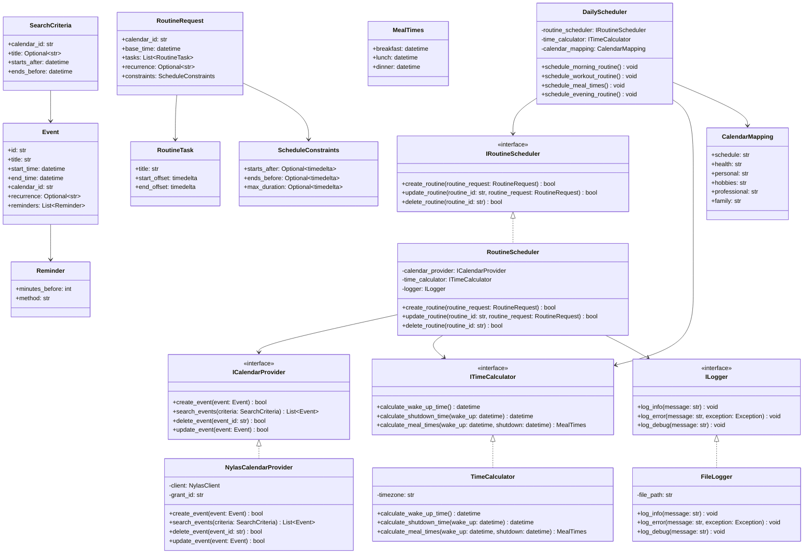

Я проанализировал ваш проект планировщика календаря. Позвольте мне дать подробный анализ структуры и рекомендации по улучшению с точки зрения ООП и принципов SOLID.
Ran tool
## Анализ текущей структуры
Ran tool
### Текущие проблемы с точки зрения SOLID:

1. **Single Responsibility Principle (SRP) - НАРУШЕН**:
   - Класс `Scheduler` отвечает за множество задач: API-коммуникацию, логику расписания, создание/удаление событий, логирование

2. **Open/Closed Principle (OCP) - НАРУШЕН**:
   - Код жестко привязан к Nylas API, нет возможности легко заменить провайдера календаря

3. **Liskov Substitution Principle (LSP) - НЕ ПРИМЕНИМ** (нет наследования)

4. **Interface Segregation Principle (ISP) - НАРУШЕН**:
   - Нет интерфейсов, клиенты зависят от всего класса целиком

5. **Dependency Inversion Principle (DIP) - НАРУШЕН**:
   - Высокоуровневые модули зависят от низкоуровневых (прямое использование Nylas Client)

## Предлагаемая улучшенная архитектура

### Ключевые улучшения архитектуры:

1. **Разделение ответственности** - каждый класс имеет одну четкую роль
2. **Dependency Injection** - зависимости передаются через конструкторы
3. **Interface-based design** - легко тестировать и заменять компоненты
4. **Паттерны проектирования**:
   - **Strategy** для различных провайдеров календарей
   - **Factory** для создания событий
   - **Builder** для сложных объектов планировщика

## Рекомендуемые книги
Ran tool
### 📚 Книги по ООП и принципам SOLID:

**Основы:**
1. **"Clean Code" - Robert C. Martin** - основы написания чистого, читаемого кода
2. **"SOLID Principles Every Developer Should Know" - Robert C. Martin** - детальное изучение принципов SOLID
3. **"Design Patterns: Elements of Reusable Object-Oriented Software" - Gang of Four** - классика паттернов проектирования

**Архитектура:**
4. **"Clean Architecture" - Robert C. Martin** - архитектурные принципы и паттерны
5. **"Building Evolutionary Architectures" - Neal Ford** - эволюционная архитектура
6. **"Architecture Patterns with Python" - Harry Percival** - паттерны архитектуры на Python

### 📖 Книги по качеству кода и практикам:

**Нейминг и стиль:**
7. **"The Pragmatic Programmer" - David Thomas, Andrew Hunt** - лучшие практики разработки
8. **"Code Complete" - Steve McConnell** - полное руководство по написанию качественного кода

**Git и документация:**
9. **"Pro Git" - Scott Chacon** - мастерство работы с Git
10. **"Docs for Developers" - Jared Bhatti** - написание технической документации

### 🧪 Тестирование:

11. **"Test Driven Development: By Example" - Kent Beck** - разработка через тестирование
12. **"Architecture Patterns with Python" - Harry Percival** - включает TDD и архитектуру

### 🐍 Специально для Python:

13. **"Effective Python" - Brett Slatkin** - идиоматичный Python код
14. **"Python Tricks" - Dan Bader** - продвинутые техники Python
Ran tool
## План рефакторинга

### 🎯 Этап 1: Создание базовой структуры (1-2 недели)

1. **Создать интерфейсы** - определить контракты для всех компонентов
2. **Создать модели данных** - `Event`, `RoutineTask`, `SearchCriteria` и т.д.
3. **Реализовать базовые сервисы** - логгер, калькулятор времени

### 🎯 Этап 2: Рефакторинг календарного провайдера (1 неделя)

1. **Создать `ICalendarProvider`** - интерфейс для работы с календарем
2. **Реализовать `NylasCalendarProvider`** - обертка над Nylas API
3. **Добавить обработку ошибок** - с использованием паттерна Result/Either

### 🎯 Этап 3: Создание планировщика рутин (1-2 недели)

1. **Реализовать `IRoutineScheduler`** - интерфейс планировщика
2. **Создать `RoutineScheduler`** - основная логика планирования
3. **Добавить валидацию** - проверка входных данных

### 🎯 Этап 4: Высокоуровневый планировщик (1 неделя)

1. **Создать `DailyScheduler`** - оркестрирует создание расписания на день
2. **Добавить конфигурацию** - внешние настройки календарей
3. **Интеграция компонентов** - связать все части через DI

### 🎯 Этап 5: Тестирование и документация (1 неделя)

1. **Unit тесты** - для всех компонентов
2. **Integration тесты** - для основных сценариев
3. **Документация** - API документация и README

## Конкретные улучшения

### 📁 Предлагаемая структура проекта:

```
scheduler/
├── src/
│   ├── domain/
│   │   ├── models/
│   │   │   ├── event.py
│   │   │   ├── routine.py
│   │   │   └── constraints.py
│   │   └── interfaces/
│   │       ├── calendar_provider.py
│   │       ├── routine_scheduler.py
│   │       ├── time_calculator.py
│   │       └── logger.py
│   ├── infrastructure/
│   │   ├── calendar/
│   │   │   └── nylas_provider.py
│   │   ├── logging/
│   │   │   └── file_logger.py
│   │   └── time/
│   │       └── time_calculator.py
│   ├── application/
│   │   ├── services/
│   │   │   └── routine_scheduler.py
│   │   └── schedulers/
│   │       └── daily_scheduler.py
│   └── main.py
├── tests/
│   ├── unit/
│   ├── integration/
│   └── fixtures/
├── config/
│   └── settings.py
├── requirements.txt
├── README.md
└── pyproject.toml
```

### 🛠 Немедленные улучшения:

1. **Убрать хардкод** - вынести API ключи в переменные окружения
2. **Добавить типизацию** - использовать `typing` для всех методов
3. **Улучшить именование** - `wake_up` → `base_time`, `shutdown` → `end_time`
4. **Разделить логику** - календарь, время, планирование в разные модули
Ran tool
## Заключение

Ваш текущий проект - отличная основа для изучения принципов SOLID и ООП! Основные проблемы связаны с монолитностью класса `Scheduler` и отсутствием абстракций.

**Приоритеты для изучения:**
1. Начните с **"Clean Code"** и **"SOLID Principles"** - это даст фундамент
2. Примените **Dependency Injection** и **Interface Segregation**
3. Изучите **паттерны проектирования** на практике
4. Добавьте **тесты** с самого начала рефакторинга

**Быстрый старт:**
1. Создайте интерфейс `ICalendarProvider`
2. Вынесите логику времени в отдельный класс `TimeCalculator`
3. Добавьте модели данных `Event`, `RoutineTask`
4. Примените Dependency Injection

Этот проект идеально подходит для отработки принципов SOLID - у вас есть четкие границы ответственности (календарь, время, планирование), что позволит красиво применить все принципы на практике!

